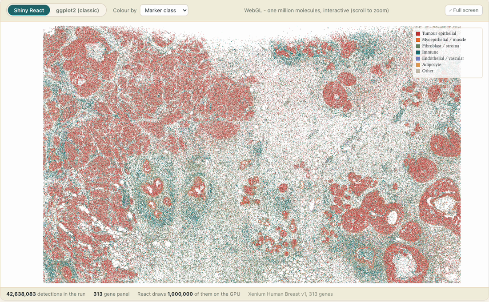

# Social posts — posit::conf(2026), `shinyreact`

Paste the post bodies as **plain text**; neither platform renders markdown.
LinkedIn truncates at ~210 characters ("…see more"), which lands just after the
string question — that is the hook, so it works.

One link in both: <https://bit.ly/posit-2026-shinyreact> → the repo, which
links out to the rendered deck. Verified: it resolves 200 to
`github.com/schloerke/presentation-2026-09-15-posit-conf-shinyreact`.

**The scheme is dropped on Bluesky only.** Bluesky builds its link facets by
detecting bare domains with a valid TLD and prepending `https://` itself, so
`bit.ly/…` links fine and saves 8 characters — worth confirming on a draft post
before you send it, since the fix is a re-post. LinkedIn does not reliably
linkify a bare domain and will not build a preview card for one, so it keeps
the full `https://`; there is room for it there.

One emoji opens each paragraph, as a marker for what the paragraph is:
🎤 the talk, 🤔 the question to the room, ⚛️ what the package does,
📚 where to read it. Bluesky counts graphemes, and every one of these is a
single grapheme, so they cost one character each — ⚛️ carries a variation
selector, which is why it is on the LinkedIn post only, where nothing is tight.

## Images

Attach one. Both live next to this file.

`shinyreact-hex.png` — the main image for both posts.
Alt: *The shinyreact hex logo — Shiny's swoosh with a React atom in its tail.*

`plotomics-live.png` — for a follow-up post about the app gallery.
Alt: *Plotomics Live rendering one million single-molecule transcripts as a dense point cloud.*

---

## Bluesky — 283 / 300 characters

🎤 Just presented "shinyreact: Building Custom Shiny UI with React" at posit::conf(2026)

🤔 Ever written JS or CSS inside an R string? shinyreact moves your UI to React: two hooks on the client, reactive_output() on the server.

📚 bit.ly/posit-2026-shinyreact

#rstats #shiny #reactjs

---

## LinkedIn — 511 characters

🎤 Just presented "shinyreact: Building Custom Shiny UI with React" at posit::conf(2026)

🤔 Ever written JavaScript or CSS inside a quoted string? No linter or test can reach it.

⚛️ shinyreact moves your UI to React and leaves Shiny's reactivity untouched. Two hooks on the client — useShinyInput() and useShinyOutputValue() — and one new concept on the server: reactive_output().

📚 Slides, source and every demo running in your browser:
https://bit.ly/posit-2026-shinyreact

#rstats #shiny #reactjs #positconf

---

## LinkedIn, second post — 1,461 characters

Attach `plotomics-live.png`, and tag Samuel so the post reaches his network too.

🧬 One slide of my posit::conf(2026) talk could not hold this, so here is the rest of it. Samuel Bharti spent the summer building bioinformatics apps in Shiny — ten in the gallery, on top of five packages he also wrote.

🔬 The five with public source: tahoe-explorer (100.6M rows, summaries pushed into DuckDB), genescout (a ranked, cited shortlist), variant-reviewer (public APIs fanned out async), gene-list-builder (re-ranks as you tune the weights), and Plotomics Live.

📦 Underneath: biobouncer asks "is this a valid ID?", bioclients asks "what do the sources say?", biohttp moves the bytes and caches the results, biocohort holds one study in one object, and plotomics draws 17 GPU-accelerated charts. Two of the five ship for R and Python both.

⚛️ Plotomics Live is the one app that reached for shinyreact, and only because the visualization demanded it: 1,000,000 single-molecule Xenium transcripts drawn on the GPU, hover to name the one under your cursor, zoom, and back out — while Shiny keeps hold of the data. 26 visualizations, 69 reactive_output() calls, one line of UI.

🎓 Each of these is deployed on Connect Cloud and archived on Zenodo, so there is a DOI to cite as well as an address.

🖼️ Gallery: https://posit-shiny-showcase-bioinformatics.share.connect.posit.cloud/
📚 Every app, package and DOI: https://www.samuelbharti.com/genomes-prompts-shiny/

Quite a summer, Samuel. 👏

#rstats #shiny #bioinformatics #python #datascience #positconf

**To shorten it**, cut the 📦 packages paragraph (−272) and the 🎓 Zenodo line
(−119); the apps and the Plotomics Live beat carry the post on their own at
~1,070.

**Do not** call the other four apps `shinyreact` apps. They are `shiny` +
`bslib` with the UI written in R, and the post's whole claim is that the fifth
reached for React because its visualization demanded it — which only lands if
the other four are honestly plain Shiny.
